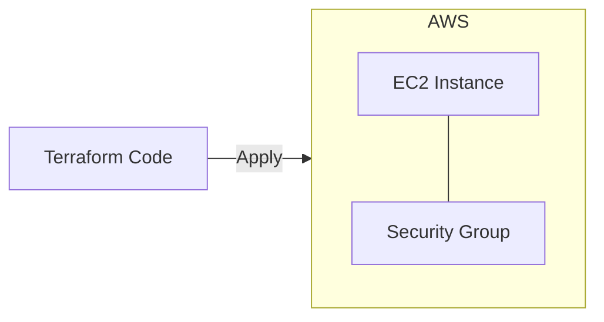

# Terraform EC2 Demo
> Rapid infrastructure provisioning on AWS using Terraform.

## 🎯 Objective
A foundational project demonstrating how to use Infrastructure as Code (IaC) to provision a secure EC2 instance with an associated security group and SSH key pair.

## 🚀 Key Features
- **Automated Provisioning:** Spin up compute resources in seconds.
- **Security-First:** Security groups defined within the code to restrict access.
- **Provider Configuration:** Best practices for AWS provider and region settings.

## 🏗️ Architecture


## 🛠️ Tech Stack
- **IaC:** Terraform
- **Cloud:** AWS (EC2, VPC)

## 🔧 Setup & Usage
1. Initialize Terraform: `terraform init`
2. Validate the plan: `terraform plan`
3. Provision: `terraform apply`

## 🧹 Cleanup
```bash
terraform destroy
```

---
Created by **Tunahan Koç** | [LinkedIn](https://www.linkedin.com/in/tunahan-koc-8b43b765/) | [GitHub](https://github.com/tnhkoc)
